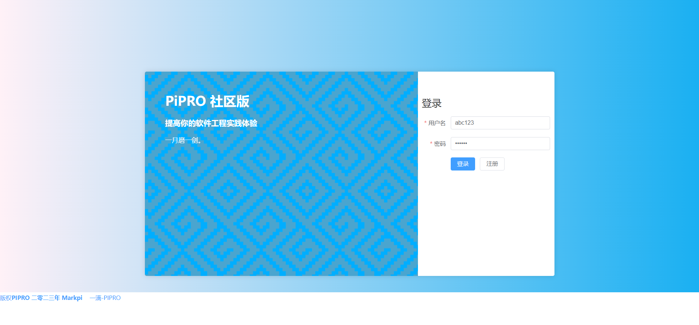
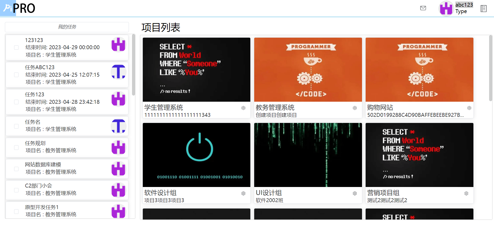
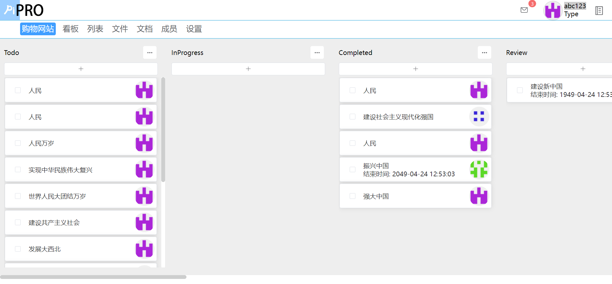
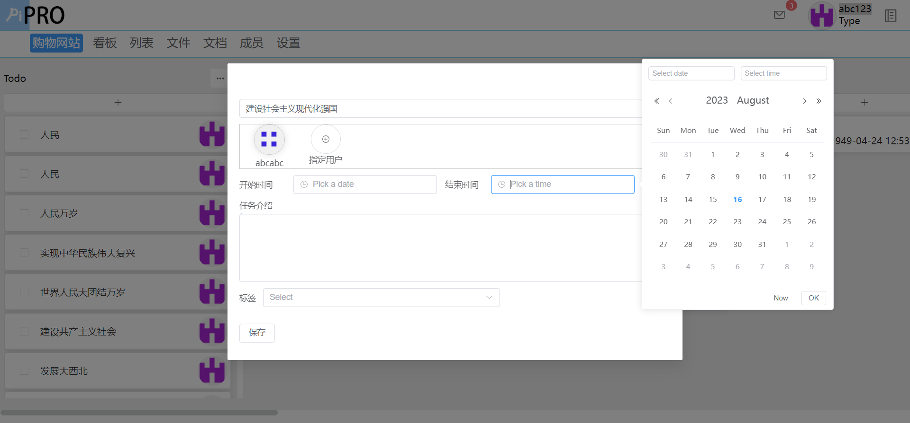
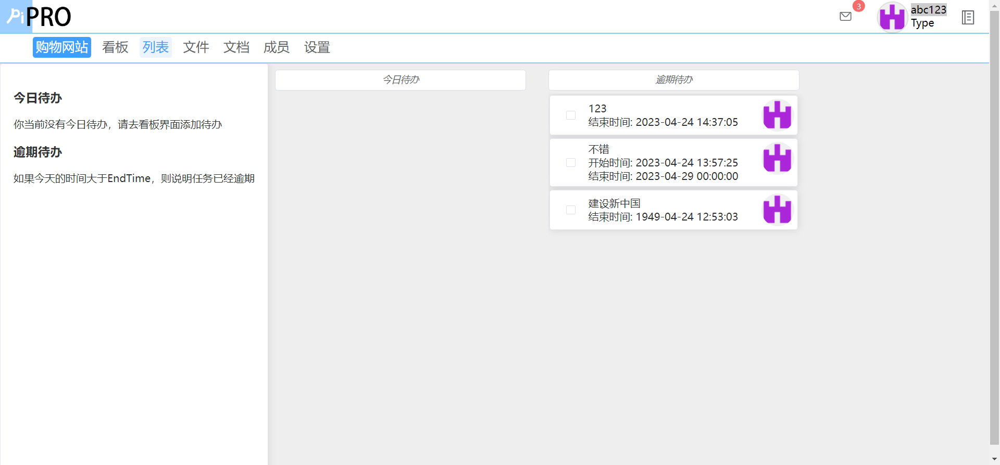
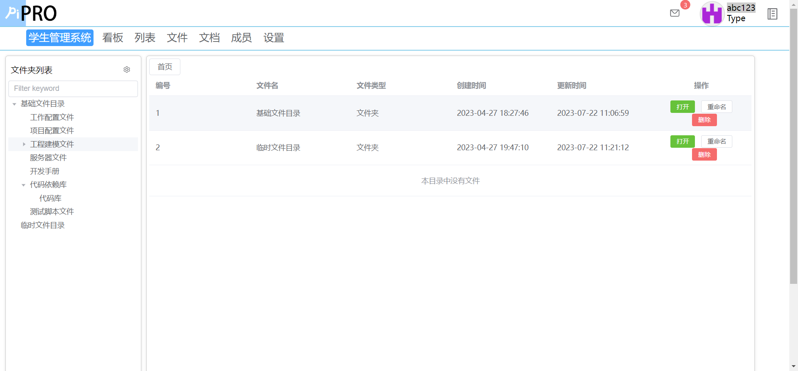
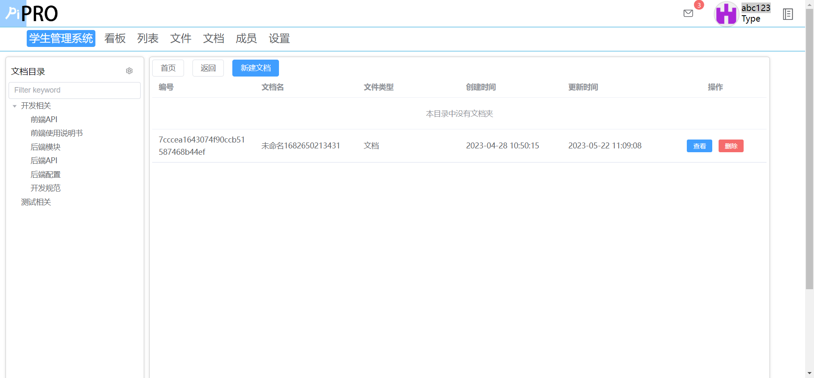
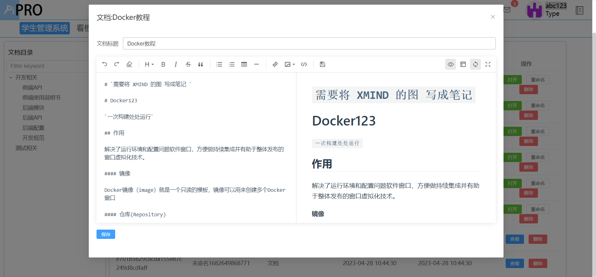
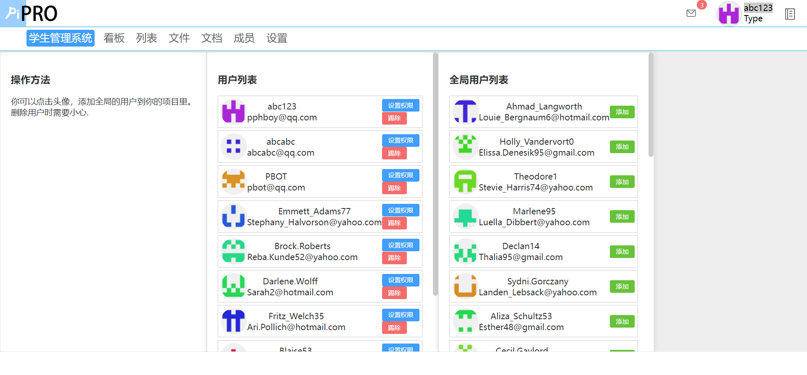
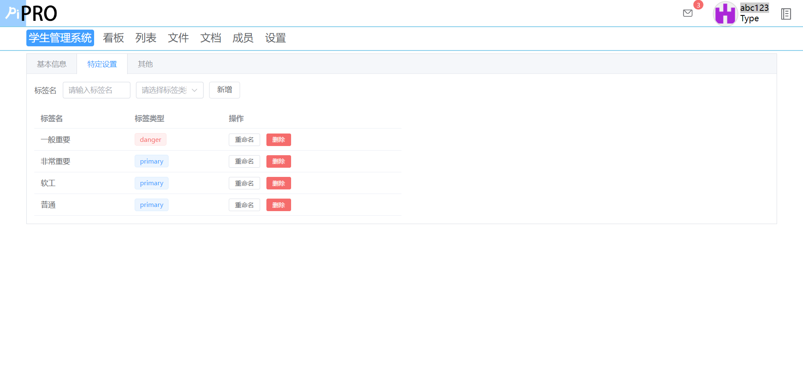

# Pipro前端

[后端-PiproServer](https://github.com/pphboy/PiproServer)

体验网址: [PiPRo体验地址](https://pipro.kbug.cn)

技术栈： Vue3(Ts) + Pinia + ElementUI + vuedraggable

PiPRO是一款适用于50人小团队的多人协同敏捷开发工具。独立部署于使用者服务器上，数据全部掌握在用户手中。包含 看板、列表、在线文件、在线文档、用户权限管理等多项敏捷开发功能。无冗余功能，方便小团队进行协同开发。

基于AOP技术自研缓存方案，让请求优化到100ms以内。PiPRO拥有非常好的性能，即使是云端，也可以把请求控制在100ms以内。这得益于使用AOP技术自主研发的缓存技术。将异步数据进行同步展示。

待办:

- 看板 (2023过年前更新完)
    - [ ] 看板同步问题
    - [ ] 看板刷新接口
- 权限
    - [ ] 项目权限可视化
    - [ ] 权限框架更新
- [ ] 回收站(删除项目、看板、任务)

演示图片: 

登录界面

首页

项目详情界面

任务详情界面

个人任务列表

在线文件

在线文档

文档编辑界面

项目成员管理

项目设置界面
